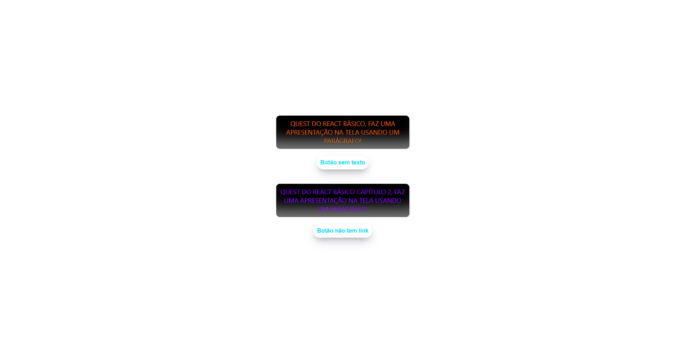
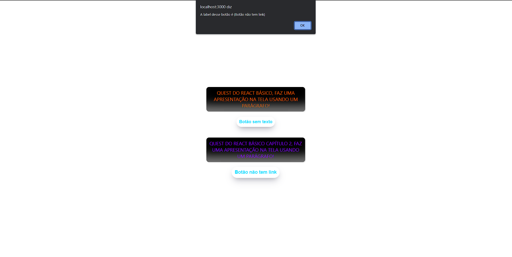

# Parágrafo e Botão com React

## Sobre o projeto

Nesse projeto é uma Quest do Dev em Dobro. ✨🧙‍♂️

Nesse quest eu dive que mostra parágrofos e botões usando somente JavaScript, React e um pouco de CSS.

#

## Objetivos da Quest 

- Colocar cores e letras maiúsculas no Parágrafo usando somente JavaScript.

- Quando clicar no Botão da um alerta com a seguinte frase (A label desse botão é ("label")). A Label é o  que esta escrito dentro do botão.

#

### Inicio do Projeto

###  Quando o usuário clicar no botão

